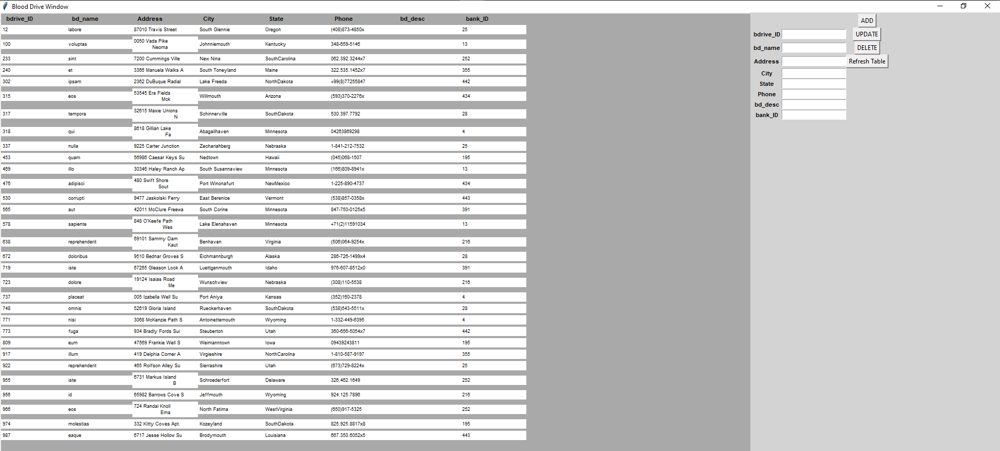
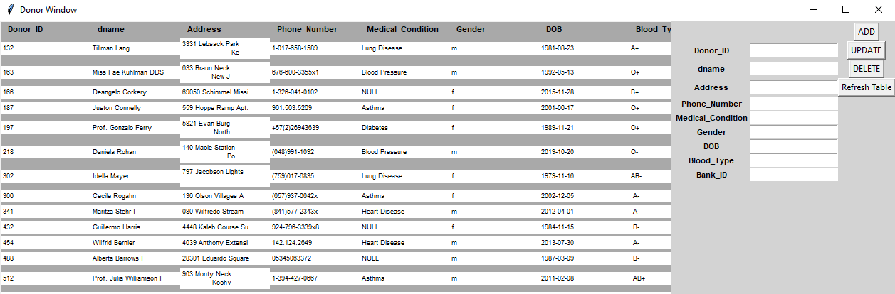
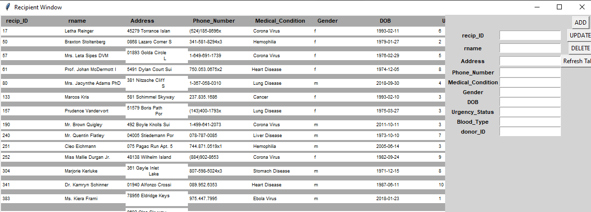

# Bloody Mary's Blood Bank

Group Members:

Matt Pitman matt_pitman@my.uri.edu</br>
Troy Durand tsdurand@my.uri.edu</br>
Hassan Bhatti hassan_bhatti@my.uri.edu</br>
Jane Trapala jane_trapala@my.uri.edu

Repository link: https://github.com/jtrapala/CSC_436_project/tree/master/final_project

## How to run

Make sure the directory is changed to final_project, or else the button images won't load.

Also, make sure the mysql.connector and tkinter packages are installed

Please change the following to match the info of the database on the local machine (in **dtb_mysql_backend.py**):

```py
    def start_c1():
    conn = mysql.connect(host="localhost",
                         user="root",
                         passwd="passwd",
                         database="BloodBank")
    return conn
```

### Linux/Mac

Make sure the line endings are changed to LF!

    /usr/bin/python3.6 /path/final_project/BloodyMaryGUI.py

### Windows

This project has CRLF line endings

```
python -u "c:\path\final_project\BloodyMaryGUI.py"
```

## Screenshots

### Main Window


### Blood Bank Window


### Blood Drive Window



### Donor Table Window



### Recipient Table Window



### Staff Table Window


### Blood Inventory Table Window


