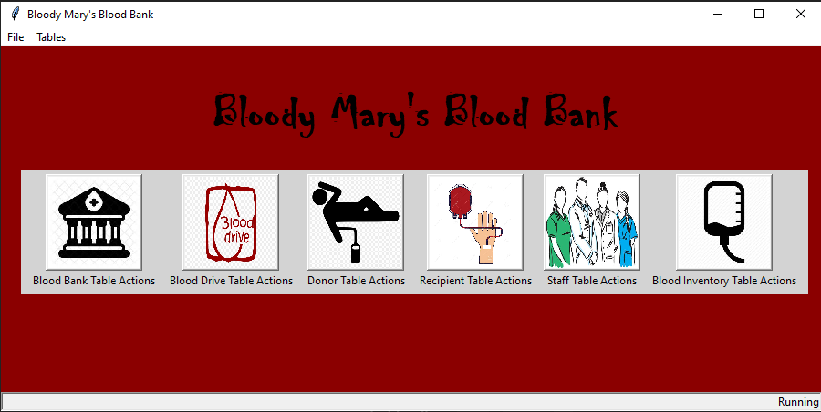
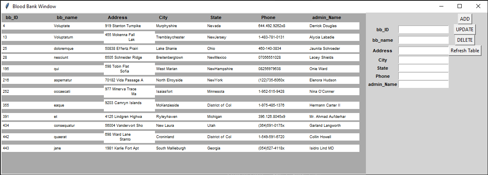
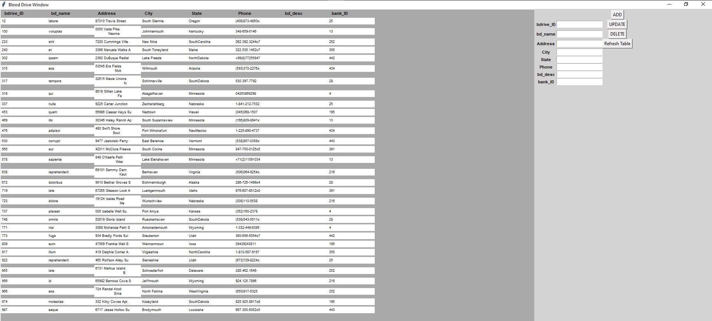
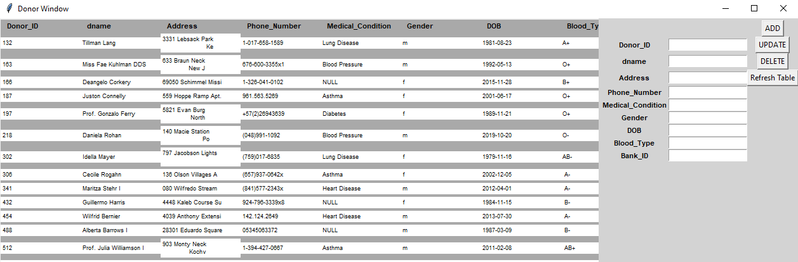
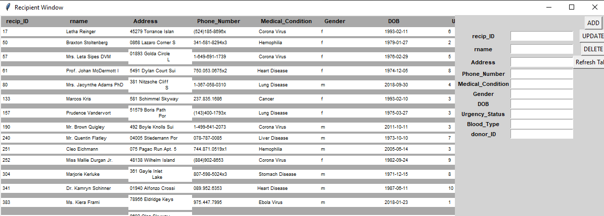
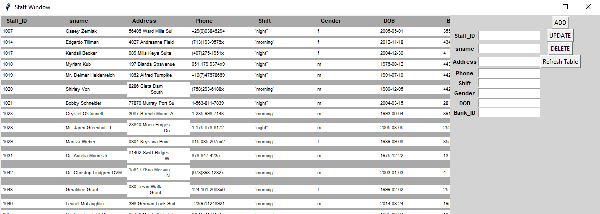
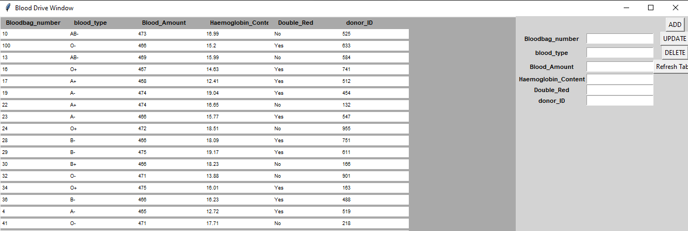

# Bloody Mary's Blood Bank

Group Members:
               Matt Pitman matt_pitman@my.uri.edu
               Troy Durand tsdurand@my.uri.edu
               Hassan Bhatti hassan_bhatti@my.uri.edu
               Jane Trapala jane_trapala@my.uri.edu

Repository link:
    https://github.com/jtrapala/CSC_436_project

## How to run

Make sure the directory is changed to final_project, or else the button images won't load

### Linux

    /usr/bin/python3.6 /path/final_project/BloodyMaryGUI.py

### Windows

## Screenshots

### Main Window

### Blood Bank Window

### Blood Drive Window

### Donor Table Window

## Recipient Table Window

## Staff Table Window

## Blood Inventory Table Window

